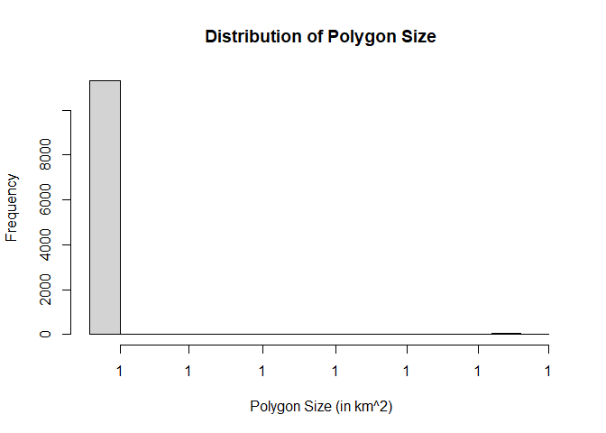
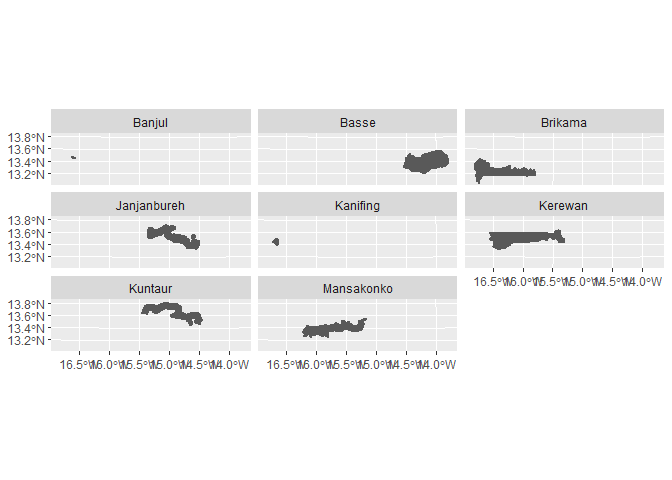

<!-- README.md is generated from README.Rmd. Please edit that file -->

# BigGeoDataManageR 

<!-- badges: start -->

[](https://github.com/SSA-Statistical-Team-Projects/BigGeoDataManageR/actions/workflows/R-CMD-check.yaml)
<!-- badges: end -->

The goal of BigGeoDataManageR is to provide utility functions for
downloading geospatial data from different sources. The databases
currently hosted include data on night lights and rainfall (with more to
come).

## Installation

You can install the development version of BigGeoDataManageR from
[GitHub](https://github.com/) with:

``` r
# install.packages("devtools")
devtools::install_github("SSA-Statistical-Team-Projects/BigGeoDataManageR")
```

## Example

Below are some samples on how to download the data (see package
documentation for more):

``` r
library(BigGeoDataManageR)
#> Warning: replacing previous import 'data.table::shift' by 'raster::shift' when
#> loading 'BigGeoDataManageR'
#> Warning: replacing previous import 'data.table::hour' by 'lubridate::hour' when
#> loading 'BigGeoDataManageR'
#> Warning: replacing previous import 'data.table::month' by 'lubridate::month'
#> when loading 'BigGeoDataManageR'
#> Warning: replacing previous import 'data.table::year' by 'lubridate::year' when
#> loading 'BigGeoDataManageR'

### download the annual night light rasters for 2020

get_annual_ntl(username = "iedochie@worldbank.org",
               password = "I651ny9@1588",
               year = 2015,
               version = "v20",
               indicator = "average_masked")
#> [1] "https://eogdata.mines.edu/nighttime_light/annual/v20/2015/VNL_v2_npp_2015_global_vcmslcfg_c202102150000.average_masked.tif.gz"
```

Some functionality is created for performing geospatial data processing.
The example below shows how we tessalate/grid a shapefile

``` r

library("ggplot2")
#> Warning: package 'ggplot2' was built under R version 4.2.3
### tessellate a Banjul area of Gambia to show how this works:

print(gmbsf_dt)
#> Simple feature collection with 8 features and 7 fields
#> Geometry type: POLYGON
#> Dimension:     XY
#> Bounding box:  xmin: 303499.5 ymin: 1442588 xmax: 630871.7 ymax: 1528188
#> Projected CRS: WGS_1984_Complex_UTM_Zone_28N
#> # A tibble: 8 x 8
#>   OBJEC~1 LGA   LGA_C~2 Shape~3 Shape~4 Land_~5 REGION                  geometry
#>     <dbl> <chr> <chr>     <dbl>   <dbl>   <int> <chr>              <POLYGON [m]>
#> 1       1 Banj~ 1        18652.  9.37e6       9 BJL    ((325593 1489584, 325648~
#> 2       2 Basse 8       224122.  2.05e9    2046 URR    ((619904.8 1498578, 6205~
#> 3       3 Brik~ 3       355085.  1.76e9    1764 WCR    ((367730.6 1473489, 3678~
#> 4       4 Janj~ 7       315131.  1.47e9    1472 CRR S~ ((494985.1 1516806, 4951~
#> 5       5 Kani~ 2        46636.  5.29e7      53 KMC    ((319806.6 1491338, 3198~
#> 6       6 Kere~ 5       346322.  2.21e9    2212 NBR    ((456172.5 1508671, 4563~
#> 7       7 Kunt~ 6       333007.  1.49e9    1493 CRR N~ ((493184.9 1527968, 4933~
#> 8       8 Mans~ 4       342397.  1.54e9    1538 LRR    ((478148.2 1498802, 4782~
#> # ... with abbreviated variable names 1: OBJECTID, 2: LGA_CODE, 3: Shape_Leng,
#> #   4: Shape_Area, 5: Land_Area

grid_dt <- 
gengrid2(shp_dt = gmbsf_dt,
         grid_size = 1000)
#> Spherical geometry (s2) switched off
#> [1] "Initiating shape object tesselation"
#> [1] "Tesselation complete for shapefile extent, ensuring validity of shapefile ..."
#> [1] "Limiting tesselated object to shapefile area ..."
#> Warning: attribute variables are assumed to be spatially constant throughout all
#> geometries
#> [1] "The shapefile is fully gridded!!"
#> Warning in st_collection_extract.sf(add_dt): x contains no geometries of
#> specified type
#> [1] "Ensuring geometries are properly fixed"
#> [1] "The tesselated object represents a total area of 11360 km^2"
```



    #> [1] "The plot window should show you a distribution of the polygon sizes"

    ggplot(grid_dt) + 
      geom_sf() + 
      facet_wrap(. ~ LGA)


